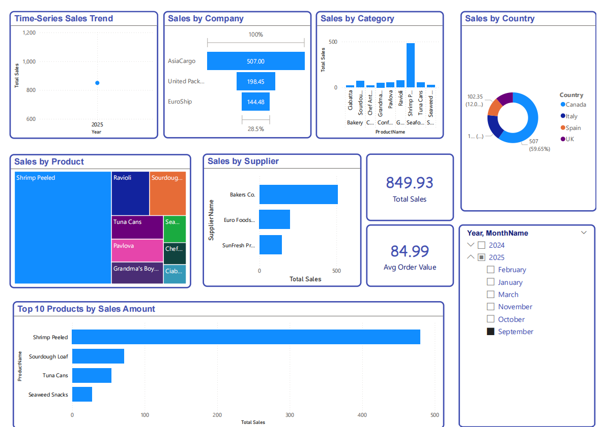
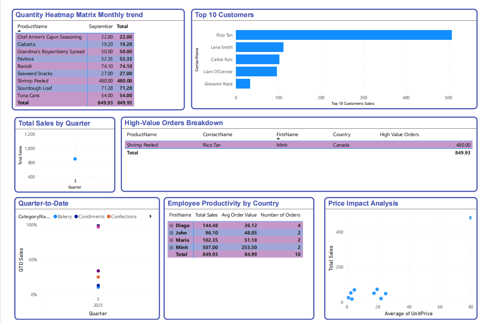

# Northwind Global Distributors – BI & Data Warehouse Project

## Course Information

**Course:** Data Warehouse & Business Intelligence Lab
**Term Project:** Fall 2025

---

## Project Objective

This project provides end-to-end, hands-on experience across the complete **Business Intelligence (BI) lifecycle**. The work covers extraction of data from multiple heterogeneous sources, transformation and integration using **SSIS**, storage in a **Dimensional Data Warehouse**, analytical modeling through **SSAS OLAP Cube**, and visualization using **Power BI dashboards**.

The project simulates a real-world enterprise BI scenario where transactional systems and external datasets must be cleaned, standardized, integrated, and transformed into actionable insights for decision-making.

---

## Case Study Background

**Northwind Global Distributors** operates using two independent OLTP databases:

* `Northwind_Source1`
* `Northwind_Source2`

Both databases contain similar schemas (Orders, Customers, Employees, Products, Categories, Suppliers, Shippers, etc.) but differ in:

* Data completeness
* Overlapping records
* Identifier inconsistencies

Additionally, two external marketing files provide **Customer Contact Names and Gender**, encoded differently:

* File 1: `M` / `F`
* File 2: `1` (Male) / `0` (Female)

The goal is to integrate all sources into a single **DW_Northwind** schema.

---

## ETL Phase Overview (Core Focus of This README)

The **ETL (Extract, Transform, Load)** phase is the backbone of this project. It ensures data consistency, quality, and readiness for analytical processing.

The ETL pipeline was designed using **BPMN diagrams** and implemented in **SQL Server Integration Services (SSIS)**.

The ETL process is divided into the following stages:

1. Extraction
2. Staging Area Load
3. Transformation & Integration
4. Dimension Loading
5. Fact Table Loading

---

## 1. Extraction Phase

### Data Sources

* **OLTP Databases**

  * Northwind_Source1
  * Northwind_Source2
* **External Files**

  * Customer Contact Names with Gender (File 1)
  * Customer Contact Names with Gender (File 2)

### Key Extraction Considerations

* Both OLTP databases share similar schemas but contain overlapping and inconsistent data.
* External files required decoding and standardization before integration.

Data was extracted **as-is** from all sources without transformation and moved into the staging layer.

---

## 2. Staging Area Load

A **staging database** was created to temporarily store all extracted data.

### Purpose of Staging

* Isolate source systems from transformations
* Enable auditing and debugging
* Preserve raw data for reprocessing if needed

### Characteristics

* One-to-one structure with source tables
* No business rules applied
* No deduplication or cleansing at this stage

All OLTP tables and external file data were loaded into staging tables using SSIS Data Flow Tasks.

---

## 3. Transformation & Integration Phase

This phase resolved heterogeneity and prepared data for dimensional modeling.

### 3.1 Gender Standardization

External gender data was harmonized into a single format:

* `M` / `1` → **Male**
* `F` / `0` → **Female**

The standardized gender attribute was later linked to customer contact names and loaded into customer-related dimensions.

### 3.2 Overlap Resolution Between Sources

* Customers, employees, products, and suppliers appearing in both sources were identified.
* Business keys were used to ensure uniqueness.
* Duplicate records were merged logically during transformation.

### 3.3 Time Dimension Preparation

A **continuous Time Dimension** was generated using the required format:

```
TimeKey = YEAR(Date) * 10000 + MONTH(Date) * 100 + DAY(Date)
```

* Date range covered from the **minimum OrderDate** to the **maximum OrderDate** across both sources.
* Ensured no gaps in the calendar.

---

## 4. Dimension Loading Strategy

The ETL strictly followed the **DW_Northwind schema rules** regarding keys.

### Business Keys (From Source)

* Category → CategoryKey
* Product → ProductKey
* Supplier → SupplierKey
* Shipper → ShipperKey
* Employee → EmployeeKey
* Time → TimeKey (YYYYMMDD)

### Surrogate Keys (Generated in DW)

* EmployeeCity → EmpCityKey
* CustomerContactCategory → CustomerCategKey
* Customer → CustomerKey

### Loaded Dimensions

* DimCustomer
* DimEmployee
* DimEmployeeCity
* DimProduct
* DimCategory
* DimSupplier
* DimShipper
* DimTime

Each dimension was loaded after resolving lookups and ensuring referential integrity.

---

## 5. Fact Table Loading – Sales

### Grain Definition

**One row per order line item** (Order + Product).

### Measures Calculated

* SalesAmount
* Quantity
* Discount
* Unit Price

### Fact Table Characteristics

* Uses surrogate key: `SalesKey`
* References all relevant dimensions
* SalesAmount computed during ETL

All foreign keys were resolved using dimension lookups in SSIS.

---

## 6. OLAP Cube & BI Consumption (Outcome of ETL)

The clean, integrated warehouse enabled:

* SSAS OLAP Cube creation
* Advanced OLAP operations (Roll-up, Drill-down, Slice, Dice)
* Power BI dashboard development

Below are snapshots of the final Power BI dashboard built on top of the ETL pipeline:

### Power BI Dashboard – Overview





---

## Key Takeaways from the ETL Phase

* Successfully integrated **multiple heterogeneous data sources**
* Resolved **data inconsistencies and overlaps**
* Implemented **industry-standard dimensional modeling**
* Generated a **robust Time Dimension**
* Enabled high-quality analytical reporting and OLAP analysis

---

## Deliverables Summary

* BPMN Control Flow Diagram
* BPMN Data Flow Diagram
* SSIS ETL Packages
* SSAS OLAP Cube
* Power BI Dashboard (.pbix)

---

**This README focuses specifically on explaining the ETL phase, which forms the foundation for all downstream analytics and decision-making in this project.**
